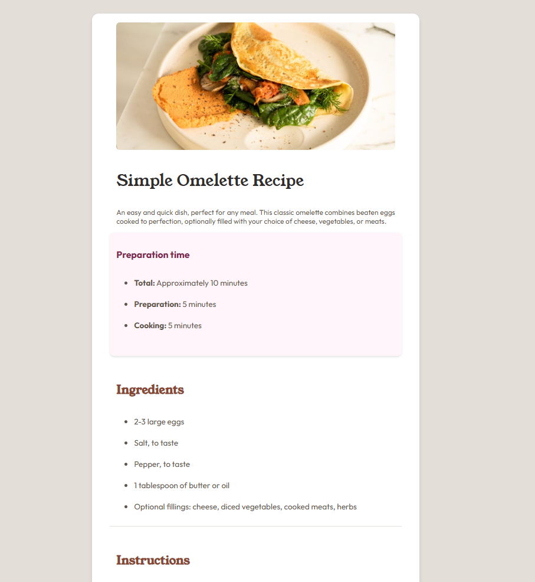

# Frontend Mentor - Solução da página de receitas

Esta é uma solução para o [desafio da página de receitas no Frontend Mentor](https://www.frontendmentor.io/challenges/recipe-page-KiTsR8QQKm). Os desafios do Frontend Mentor ajudam você a aprimorar suas habilidades de programação através da criação de projetos realistas. 

## Índice

- [Visão geral](#visão-geral)
  - [Captura de tela](#captura-de-tela)
  - [Links](#links)
- [Meu processo](#meu-processo)
  - [Construído com](#construído-com)
  - [O que aprendi](#o-que-aprendi)
  - [Desenvolvimento contínuo](#desenvolvimento-contínuo)
- [Autor](#autor)
- [Agradecimentos](#agradecimentos)

**Observação: Apague esta nota e atualize o índice com base nas seções que você mantiver.**

## Visão geral

SIte de Cardápio simples. Usando HTML para estruturação da página, CSS para estilização do corpo ddo site e Media queries para fins de etilização responsiva.

### Captura de tela




### Links

- Github: [Repositório do Github](https://github.com/kwlg1/RECIPE-PAGE-MAIN.git)
- Site: [Site da Solução](https://kwlg1.github.io/RECIPE-PAGE-MAIN/)

## Meu processo

1. Criação da Estrutura HTML
2. Criação da Estilização (CSS)
3. Estudando sobre Resposividade.
4. Criando Media Queries para lidar com aos difrentes tipos e tamanhos de telas.

### Construído com

- Marcação HTML5 semântica
- Propriedades personalizadas CSS
- Flexbox
- Fluxo de trabalho mobile-firs


### O que aprendi

Aprendi a criar estrutura HTML para containers e cards responsivos. Támbem apreendi e comecei a usar Media Queries apara fins de resposividade para direntes proporções de tels (Mobile, Tablet, Deskto....).

Trechos de código da solução estão abaixo:

Trecho do código HTML:
```html
 <div class="container">

    

    <h1>Simple Omelette Recipe</h1>

    <p>
      An easy and quick dish, perfect for any meal. This classic omelette combines beaten eggs cooked
      to perfection, optionally filled with your choice of cheese, vegetables, or meats.
    </p>

    <div class="card-preparation">

    <h3>Preparation time</h3>

    <ul>
      <li><b>Total:</b> Approximately 10 minutes</li><br>
      <li><b>Preparation:</b> 5 minutes</li><br>
      <li><b>Cooking:</b> 5 minutes</li><br>
    </ul>


    </div>
```

Trecho do código em CSS:
```css
.card-preparation {
    width: 90%;
    background-color: hsl(330, 100%, 98%);
    padding: 15px;
    border-radius: 10px;
    box-shadow: 0 2px 4px rgba(0, 0, 0, 0.1);
    margin-bottom: 20px;
    display: flex;
    flex-direction: column;
}
.card-ingredients, .card-instructions, .card-nutrition {
    width: 90%;
    padding: 15px;
    margin-bottom: 20px;
    display: flex;
    flex-direction: column;
    border-bottom: 1px solid  hsl(30, 18%, 87%);
}
```

trecho do código css para média queries:
```css
@media screen and (min-width: 950px) {
    body {
        background-color: hsl(30, 18%, 87%);
        font-size: 18px;
        margin-top: 100px;
    }

    .container {
        background-color: hsl(0, 0%, 100%);
        max-width: 700px;
        margin: 0 auto;
        padding: 20px;
        border-radius: 15px;
        box-shadow: 0 4px 8px rgba(0, 0, 0, 0.1);
    }

}

/* Estilo padrão (ex: para Celulares e Tablets) */

@media screen and (max-width: 949px) {
    body {
        background-color: hsl(0, 0%, 100%);
        top: 0;
    }

    .container {
        width: 95vw;
        margin-top: 50%;
    }
    img {
        position: absolute;
        top: 0;
        width: 100%;
        height: auto;
        border-radius: 0;
        padding-top: 0;
    }
}

```


### Desenvolvimento contínuo

Prentendo continuar do estudo extensivo de desevolvimento web. Focando na parte de estilização (CSS e frameworks de estílos) e tambem a parte de responsividade.

## Autor

- Frontend Mentor - [@kwlg1](https://www.frontendmentor.io/profile/kwlg1)
- Github - [@kwlg1](https://github.com/kwlg1)

**Observação: Apague esta nota e adicione/remova/edite as linhas acima de acordo com os links que você gostaria de compartilhar.**

## Agradecimentos

Agradeço a plataforma da Frontend Mentor pelo modelo e arquivos, designs fornecidos para a criação da solução.
